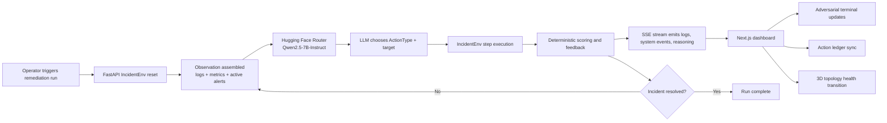

# SRE-Bot

<div align="center">

Production-grade incident remediation RL environment for observability-driven failure handling, agentic triage, and real-time operator feedback.

<p>
  
  
  
  
  
</p>

<p>
  
</p>

</div>

## Overview

`SRE-Bot` is a full-stack incident remediation environment built for agent evaluation under production-shaped conditions. The platform combines a `Next.js` control surface, a `FastAPI` execution engine, a live SSE event stream, and a 3D topology map that reflects remediation state as the agent works through an outage.

The design goal is straightforward: turn incident handling into a repeatable loop with strong Observability, explicit action selection, and Deterministic Scoring. The environment emits logs, metrics, and action feedback as structured observations. The agent reasons over that state, selects from a constrained remediation action space, and continues until the fault is resolved or the step budget is exhausted.

🌍 Live Dashboard (Vercel): https://sre-bot-autonomous-incident-remedia-five.vercel.app

🧠 Backend API / Swagger (Hugging Face Spaces): https://aravind20-sre-bot-engine.hf.space/docs

## Quick Glance

| Layer | Technology | Role |
| --- | --- | --- |
| Frontend | Next.js 16, React 19, TypeScript | Operator console, terminal stream, topology rendering, action ledger |
| Visualization | Three.js, React Three Fiber, Drei | Real-time topology map and service health visualization |
| Backend | FastAPI, Python 3.9 | Incident environment, SSE transport, remediation orchestration |
| Agent Runtime | Hugging Face Router | LLM-driven action selection and streamed reasoning |
| Environment Model | Pydantic, enum-based action space | Typed observations, constrained actions, deterministic transitions |
| Streaming | Server-Sent Events | Low-latency propagation of logs, thinking traces, and remediation updates |

## System Flow



## Core Capabilities

- Real-time Observability pipeline with SSE-delivered terminal events and system annotations.
- Remediation Loop driven by a constrained `ActionType` enum instead of unconstrained free-form tool execution.
- 3D service topology that reacts to incident progress and service health changes.
- Auto-synchronized action ledger that mirrors execution intent from streamed events.
- Deterministic Scoring path for repeatable evaluation of agent performance across incident runs.
- LLM reasoning stream surfaced directly to the UI for operator inspection and debugging.

## 🚀 Recent Production Features

- Production-Grade Deployment: Fully Dockerized FastAPI backend securely hosted on Hugging Face Spaces (`python:3.9-slim`).
- Zero-CORS Architecture: Seamless cross-origin communication between the Next.js Edge network and Hugging Face infrastructure.
- Autonomous LLM Loop: Live integration with `Qwen/Qwen2.5-7B-Instruct` for real-time `[THINKING]`, action execution (`check_logs`, `rollback_config`), and deterministic scoring.

## Architecture

### Frontend

The dashboard is built in `dashboard/` with the App Router in `Next.js`. The parent page owns the SSE connection and lifts shared state for:

- connection health
- terminal log events
- system status transitions
- action ledger entries

The right-hand operational surfaces stay synchronized because they all consume the same upstream event stream rather than maintaining local heuristics.

### Backend

The engine in `engine/` exposes:

- `GET /api/stream-logs` for SSE transport
- `POST /api/trigger-demo` to start the remediation loop
- `POST /api/run-agent` as an alias for agent execution

The FastAPI service owns the incident simulation, event emission, and LLM loop. Observations include health, active alerts, recent logs, metrics, and the last action feedback so the model operates on the same state an SRE would inspect during live triage.

## Repository Layout

```text
.
├── dashboard/   # Next.js UI, topology view, terminal, action ledger
├── engine/      # FastAPI app, incident environment, stream transport, LLM agent
└── graders.py   # Evaluation helper entrypoint
```

## Local Setup

The backend is now live on Hugging Face Spaces. For frontend-only local development, you can point `NEXT_PUBLIC_API_URL` at `https://aravind20-sre-bot-engine.hf.space` and run the dashboard without starting the backend locally.

### 1. Start the backend

```bash
cd engine
export HF_TOKEN=your_hugging_face_token
uvicorn main:app --reload --host 127.0.0.1 --port 8000
```

### 2. Start the dashboard

```bash
cd dashboard
npm install
export NEXT_PUBLIC_API_URL=https://aravind20-sre-bot-engine.hf.space
npm run dev
```

Open `http://localhost:3000` and connect the dashboard to the production SSE stream at `https://aravind20-sre-bot-engine.hf.space/api/stream-logs`, or start the backend locally if you want a full local stack.

## Runtime Notes

- The SSE channel is hardened for long-lived browser connections with explicit `text/event-stream` headers, proxy buffering disabled, and periodic keep-alives.
- The agent currently targets the Hugging Face Router chat completions API.
- The remediation action space is intentionally bounded to support evaluation, replayability, and stable grading behavior.

## Why This Design

Most hackathon demos stop at a chat box and a spinner. `SRE-Bot` is structured more like an operator-facing control plane: observable state, explicit remediation intent, and a feedback loop that can be scored, debugged, and improved. That makes it useful both as a demo surface and as an evaluation harness for incident-response agents.
